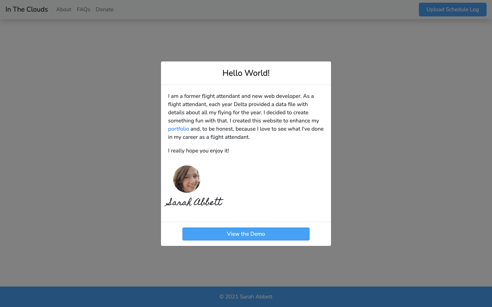
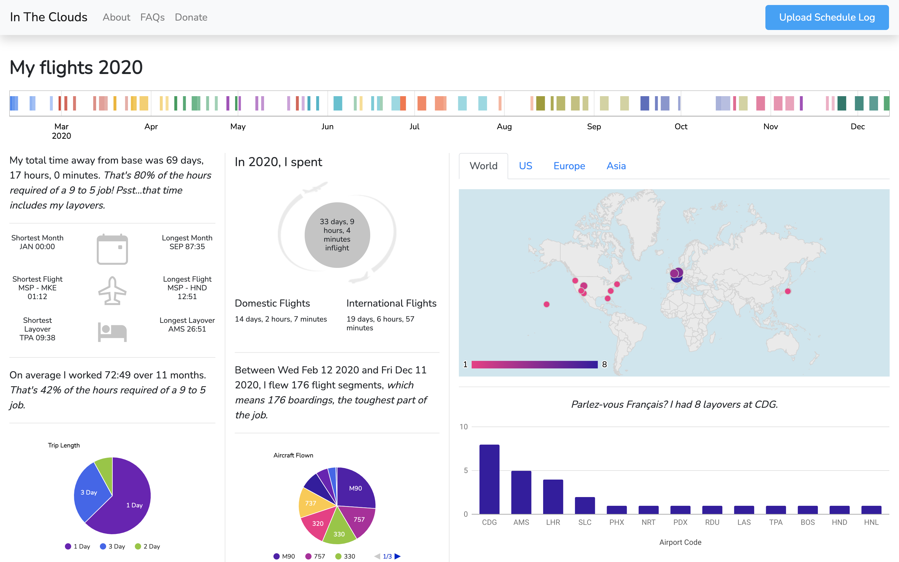
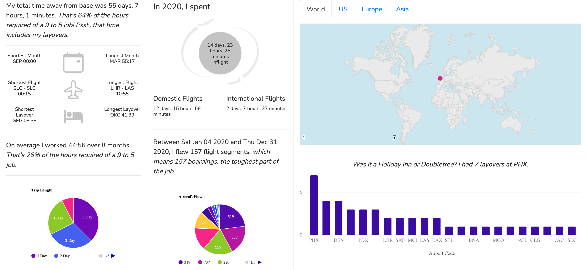

# In The Clouds

> I created this project after completing a coding bootcamp at Thinkful. This is a personal project for Delta Airlines flight attendants, my former coworkers.

## Project Description

> Each year, I received a .csv file of all the flight data for the flights that I worked that year. I wanted to see what I could create with this data.
> Each line in the file represents a flight segment. These flight segments were grouped by rotation number. I created a Map for each rotation so that I could keep all data together by rotation. The key is the rotation date since the rotation number itself could be duplicated througout the data.

## Built With

- React.js
- Bootstrap
- CSS
- JSX
- Javascript
- Node.js

## Deployment

- [In The Clouds](https://intheclouds.us/)

## Screenshots

## Demo screenshot

## Share screenshot

## What I Learned

- React-Papaparse

- React-Google-Charts

- React-Responsive

- React-Share

- Formspree

- React-Bootstrap-Modal

## Future Upgrades

> A database to store flight data by user.
> Compare data year to year.
